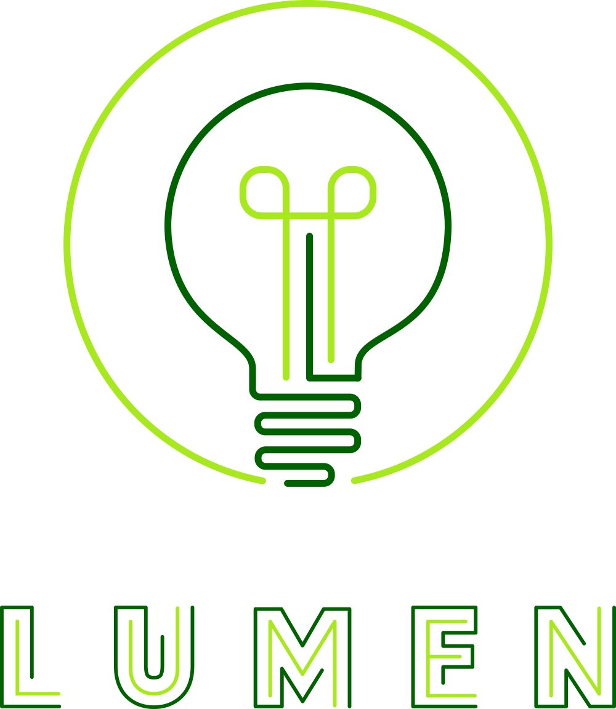

# 💡 LUMEN token

The LUMEN token is the governance token of Tranquility City.

  
**LAUNCH WILL ANNOUNCED SOON ON SOCIAL MEDIA**

**Tokenomics:**

* 10 000 000 total supply
* 70% paired initially
* 20% developer fund
* 10% used for marketing, airdrops, partnerships, etc.

**The token will be used for a variety of things:**

* Governance voting
* In-game marketplace
* In-game games/activities
* And much more!


You can purchase LUMEN on [DeFi Kingdoms](https://game.defikingdoms.com/#/marketplace)


